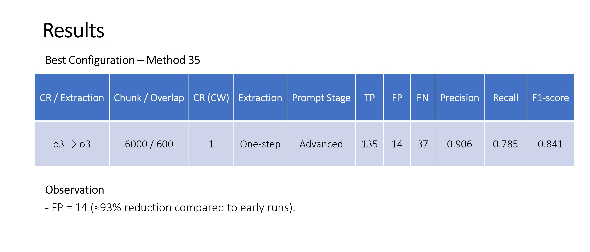
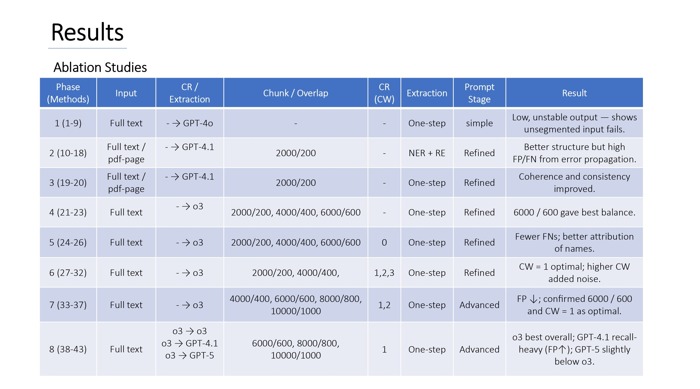

# Network Data Extraction using LLMs for Historical Documents
### Entity and Relationship Extraction from WWII-era Memoirs

> **Master's Thesis — University of Luxembourg (C²DH), October 2025**  
> Author: Emad Kalantari Khalilabad | Supervisor: Prof. Martin Theobald | Advisor: Ass. Prof. Marten During  
> *Findings are being prepared for publication in a peer-reviewed journal.*

---

## Overview

This project investigates whether Large Language Models (LLMs) can reliably extract structured social network data — specifically entities and their relationships — from long-form historical narrative texts.

The case study is the memoir *Memories from My Early Life in Germany 1926–1946* by Ralph Neuman, a first-person account of survival during WWII. The memoir contains dense networks of support relationships: people who provided shelter, food, false documents, medical care, and emotional support to those living underground.

The core challenge is bridging **Digital History** and **Computer Science**: reconstructing historically meaningful survival networks in a way that is both computationally reliable and interpretively accurate.

---

## The Pipeline

The framework implements a modular, end-to-end NLP pipeline:

```
Raw Text
   │
   ▼
1. Text Cleaning          ← removes formatting artifacts, normalizes whitespace
   │
   ▼
2. Chunking               ← overlapping segments via LangChain RecursiveCharacterTextSplitter
   │                         (optimal: 6000 chars / 600 overlap)
   ▼
3. Coreference Resolution ← LLM resolves pronouns ("he", "they") and family names
   │  (Stage 1)              ("the Fleischers") → explicit individual names
   │                         Uses a context window of 1 preceding chunk for cross-boundary references
   ▼
4. Relationship Extraction ← LLM identifies entity pairs + relationship type + evidence
   │  (Stage 2)               Output: structured JSON
   ▼
5. Output: NER_results.json  ← all relationships across all chunks, merged per run
```

Both Stage 1 (CR) and Stage 2 (Extraction) support independent model selection from:
- **OpenAI o3** reasoning model (best overall — used for both stages in the optimal configuration)
- **GPT-4.1** (highest recall, but noisy — more false positives)
- **GPT-5** (tested; did not outperform o3)

---

## Key Results

43 experimental configurations were tested, progressively adding preprocessing steps and refining prompts. The best configuration (Method 35) achieved:

| Model (CR → Extraction) | Chunk / Overlap | CR Context Window | Prompt | Precision | Recall | F1-score |
|---|---|---|---|---|---|---|
| o3 → o3 | 6000 / 600 | 1 | Advanced | **0.906** | **0.785** | **0.841** |


*F1-score improved from ~0.37 (naive single-pass baseline) to 0.841 — a 250%+ improvement.*

**Best configuration summary (Method 35):**



**10-run stability analysis** confirmed reproducibility across three top configurations:


| Method | CR / Extraction | Precision (avg) | Recall (avg) | F1 (avg) |
|---|---|---|---|---|
| 35 | o3 → o3 | 0.845 | 0.795 | **0.819** |
| 39 | o3 → GPT-4.1 | 0.764 | 0.866 | 0.812 |
| 43 | o3 → GPT-5 | 0.772 | 0.754 | 0.763 |

**Ablation study overview (all 43 methods):**



---

## Relationship Types

The framework extracts 9 predefined relationship categories, focused on survival-critical acts of help:

1. Providing shelter or protection
2. Providing medical care
3. Providing food or material resources
4. Making introductions or connections
5. Providing employment or work opportunities
6. Providing false documentation or identity assistance
7. Sharing information or advice
8. Providing emotional support or companionship
9. Other helping or assisting

---

## What the Framework Outputs

Each run produces a `NER_results.json` file with the following structure per chunk:

```json
{
  "relationships": [
    {
      "entity1": "Leo Fraines",
      "entity2": "Ralph Neuman",
      "Form of help": "Providing food or material resources",
      "evidence": "he kept supplying me with money, food and encouragement"
    }
  ]
}
```

The output also includes run metadata: model names, parameters, chunk settings, context window size, timestamps, and the full prompts used — ensuring full reproducibility.

---

## Installation & Usage

**1. Clone the repo**
```bash
git clone https://github.com/your-username/llm-historical-network-extraction.git
cd llm-historical-network-extraction
```

**2. Install dependencies**
```bash
pip install -r requirements.txt
```

**3. Set your API key**
```bash
cp .env.example .env
# Edit .env and add your OpenAI API key
```

**4. Add your input text**

Open `entity_relationship_extraction.py` and replace the `input_text` variable with your source text.

**5. Configure the pipeline**

At the top of the script, set your desired configuration:

```python
STAGE1_MODEL = "o3-2025-04-16"      # Model for Coreference Resolution
STAGE2_MODEL = "o3-2025-04-16"      # Model for Relationship Extraction
CHUNK_SIZE = 6000                    # Optimal chunk size (characters)
CHUNK_OVERLAP = 600                  # Overlap between chunks
CONTEXT_WINDOW = 1                   # Previous chunks used as CR context
```

**6. Run**
```bash
python entity_relationship_extraction.py
```

The script is interactive — it will prompt you to review intermediate outputs (cleaned text, chunks, resolved text) before proceeding to the next stage. You can also resume from a saved `resolved_text.txt` checkpoint to skip re-running Stage 1.

---

## Configuration Options

| Parameter | Tested values | Optimal |
|---|---|---|
| Chunk size / overlap | 2000/200, 4000/400, **6000/600**, 8000/800, 10000/1000 | **6000/600** |
| Context window (CW) | 0, **1**, 2, 3 | **1** |
| Stage 1 model | GPT-4.1, GPT-5, **o3** | **o3** |
| Stage 2 model | GPT-4.1, GPT-5, **o3** | **o3** |
| Prompt type | Simple, Refined, **Advanced** | **Advanced** |

---

## Dataset Note

The source memoir (*Memories from My Early Life in Germany 1926–1946* by Ralph Neuman) and the manually annotated ground-truth dataset (176 positive relationships, 60 entities) are **not included** in this repository due to copyright and privacy considerations. Please contact the [C²DH at the University of Luxembourg](https://www.c2dh.uni.lu/) for access inquiries.

---

## Project Context

This work sits at the intersection of:
- **Natural Language Processing** — entity extraction, coreference resolution, information extraction
- **Digital History** — computational reconstruction of WWII survival networks
- **Prompt Engineering & LLM Evaluation** — systematic benchmarking of 43 configurations across 4 OpenAI models

The project was conducted over ~20 months at the [Luxembourg Centre for Contemporary and Digital History (C²DH)](https://www.c2dh.uni.lu/), University of Luxembourg, in roles spanning student researcher, research intern, and master's thesis.

---

## Citation / Reference

If you use or reference this work, please cite:

```
Kalantari Khalilabad, E. (2025). Network Data Extraction using LLMs for Historical Documents:
A focus on Entity and Relationship Extraction. Master's Thesis, University of Luxembourg.
```

---

## License

This code is released for academic and research use. See `LICENSE` for details.
