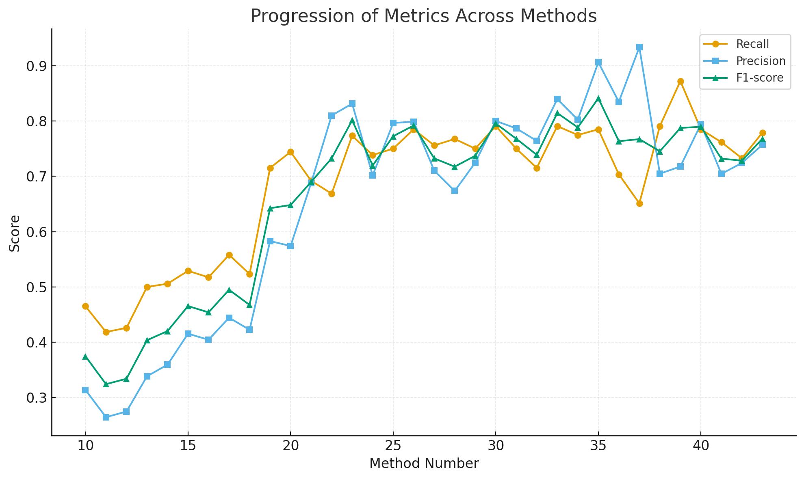
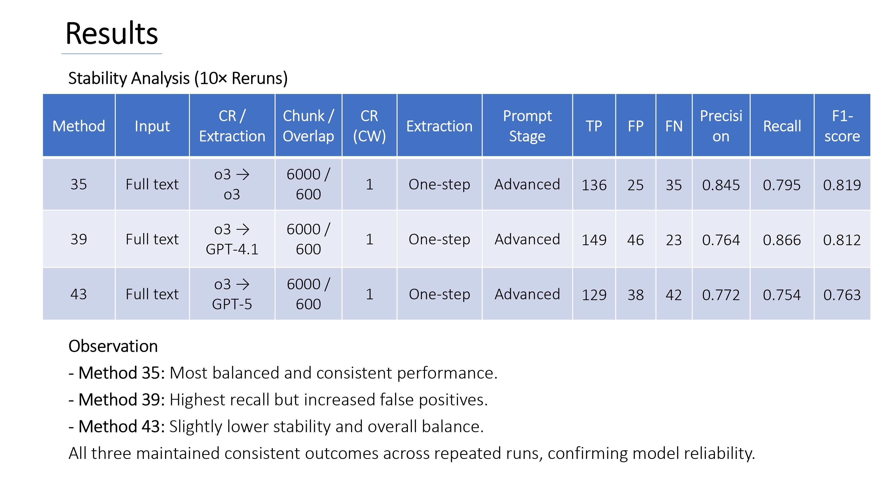

# Network Data Extraction using LLMs for Historical Documents
### Entity and Relationship Extraction from WWII-era Memoirs

> **Master's Thesis — University of Luxembourg (C²DH), October 2025**  
> Author: Emad Kalantari Khalilabad | Supervisor: Prof. Martin Theobald | Advisor: Ass. Prof. Marten During  
> *Findings are being prepared for publication in a peer-reviewed journal.*

---

## Overview

This project investigates whether Large Language Models (LLMs) can reliably extract structured social network data — specifically entities and their relationships — from long-form historical narrative texts.

The case study is the memoir *Memories from My Early Life in Germany 1926–1946* by Ralph Neuman, a first-person account of survival during WWII. The memoir contains dense networks of support relationships: people who provided shelter, food, false documents, medical care, and emotional support to those living underground.

The core challenge is bridging **Digital History** and **Computer Science**: reconstructing historically meaningful survival networks in a way that is both computationally reliable and interpretively accurate.

---

## The Pipeline

The framework in this repository is the **final, optimized version** that emerged after 43 experimental configurations. It implements a modular, end-to-end NLP pipeline:

```
Raw Text
   │
   ▼
1. Text Cleaning          ← removes formatting artifacts, normalizes whitespace
   │
   ▼
2. Chunking               ← overlapping segments via LangChain RecursiveCharacterTextSplitter
   │                         (optimal: 6000 chars / 600 overlap)
   ▼
3. Coreference Resolution ← LLM resolves pronouns ("he", "they") and family names
   │  (Stage 1)              ("the Fleischers") → explicit individual names
   │                         Uses a context window of 1 preceding chunk for cross-boundary references
   ▼
4. Relationship Extraction ← LLM identifies entity pairs + relationship type + evidence
   │  (Stage 2)               Output: structured JSON per chunk
   ▼
5. Output: NER_results.json  ← all relationships across all chunks, merged per run
```

Both Stage 1 (Coreference Resolution) and Stage 2 (Relationship Extraction) support independent model selection from:
- **OpenAI o3** reasoning model — best overall, used for both stages in the optimal configuration
- **GPT-4.1** — highest recall but introduces more false positives
- **GPT-5** — tested; did not outperform o3

---

## Research Background: How the Pipeline Evolved

The framework you see here is the result of a long iterative process. Understanding how it evolved helps clarify the design decisions embedded in the code.

### Extraction Strategy: One-step vs. Multi-step (NER + RE)

Two fundamentally different extraction strategies were tested across the 43 experimental methods:

**Multi-step (NER + RE)** — used in earlier experiments. The text was first passed through Named Entity Recognition (NER) using five separate prompts, each targeting a different entity type. The resulting entities were consolidated into a list, which was then fed into a separate Relationship Extraction (RE) step. While this approach added structure, it proved fragile: errors in the NER stage (missed or irrelevant entities) propagated directly into the RE stage, resulting in both high false positives and high false negatives. This strategy was eventually abandoned.

**One-step extraction** — adopted in later experiments and used in the final framework. Entities and relationships are identified together in a single API call per chunk. Once supported by proper preprocessing (chunking and coreference resolution) and well-designed prompts, this simpler approach outperformed the multi-step design in both precision and recall, and is significantly easier to maintain and extend.

---

### Coreference Resolution (CR): What It Is and Why It Matters

Historical narratives rarely repeat full names. A memoir passage might say "He gave me the papers" or "The Fleischers let us stay" — leaving the actual individuals ambiguous or unnamed. Without resolving these references, an LLM will either miss relationships entirely (false negatives) or attribute actions to the wrong person (false positives).

Coreference Resolution (CR) was introduced as a dedicated preprocessing step before relationship extraction. Its role is to replace all ambiguous references in each text chunk with explicit entity names, so the extraction model works with clear, unambiguous text.

CR was implemented in two stages:

**Stage 1 — Pronoun resolution:** personal pronouns (he, she, they, we, etc.) are replaced with the actual names of the people they refer to. For example, "He gave me papers" becomes "Walter Neuman (he) gave me papers." The original pronoun is preserved inline, with the resolved name added immediately after in brackets.

**Stage 2 — Family and collective reference resolution:** group references like "the Fleischers" or "the Wendlands" are expanded to the known individual members of that household — specifically the adult heads, e.g. "Walter Fleischer, Agnes Fleischer." This was critical because many helping acts in the memoir are attributed to families rather than named individuals, and the ground truth tracks relationships at the individual level.

#### CR Prompts

CR uses two prompts per chunk, which was the same two-prompt design used throughout the project:

**System prompt** — contains all rules and structural instructions that remain constant across every chunk. For CR, this includes: always preserve the original sentence structure and punctuation; insert resolved names immediately after the reference in square brackets; for pronoun resolution, keep the pronoun and add the name (e.g. `they [Walter Neuman, Rita Neuman]`); for family references, expand to the known adult members of that household if their names appear in the text, or leave the family name bracketed unchanged if they do not; never paraphrase or rewrite the original text.

**User prompt** — constructed dynamically for each chunk. It contains the current chunk as the main text to be processed, and optionally one or more preceding chunks as a reference context section (see Context Window below). The model is explicitly instructed to perform resolution only on the main text, using the context section for reference only without modifying it.

#### Context Window

Even with chunking, a pronoun in one chunk might refer to an entity introduced in a previous chunk. To address this, the CR step supports a configurable **context window** — a number of preceding chunks included in the user prompt as reference material alongside the current chunk being processed.

| CW setting | What is included | Observed effect |
|---|---|---|
| 0 | No previous context (baseline) | Fast, but frequent cross-boundary omissions; model unaware of entities from earlier chunks |
| **1** | 1 preceding chunk as context | Clear improvement: recall ↑ ~12–15%, precision stable — **best overall balance** |
| ≥ 2 | 2 or more preceding chunks | Excess context caused the model to lose focus; precision dropped; more false negatives introduced |

The context window of 1 is the optimal setting and the default in the framework. Adding more context beyond one chunk did not help — it created noise rather than clarity.

---

### Relationship Extraction Prompts

The extraction step (Stage 2) also uses the same two-prompt structure:

**System prompt** — the rulebook for the extraction task. It defines all 9 relationship types with detailed descriptions, specifies inclusion and exclusion rules (only survival-critical acts of help count — not casual conversation or routine daily interactions), handles edge cases such as bureaucratic actions that became life-saving in context (e.g. issuing identity papers to a person living underground), defines the output schema precisely (JSON with `entity1`, `entity2`, `Form of help`, `evidence` fields), and explains how to handle entities expressed as pronouns or family names in the resolved text.

**User prompt** — short and focused. It provides the resolved chunk text and asks the model to extract all help-related relationships from it according to the system rules. Keeping the user prompt minimal and consistent across all chunks was intentional — it separates the stable rulebook (system) from the variable content (user), making outputs more predictable.

#### Prompt Engineering: An Iterative Research Process

Prompts were a central research variable and went through three broad stages of development. These stages are not selectable parameters in the framework — they describe the research journey. The prompts embedded in the framework are the final, most refined version.

**Stage 1 — Simple prompts:** basic instructions with no schema, no definitions, and no constraints. Established a baseline but produced noisy, inconsistent outputs.

**Stage 2 — Refined prompts:** introduced explicit definitions for all 9 relationship types, inclusion/exclusion rules focusing only on survival-relevant interactions, and a structured JSON output schema. Made outputs consistent and aligned them with the ground truth format.

**Stage 3 — Advanced prompts (current):** built on the refined stage by adding detailed contextual clarifications for borderline cases — for example, distinguishing between a routine job offer and employment arranged specifically as cover for someone living underground, or recognising that issuing an ID card to a persecuted person is an act of survival support even if the official acted routinely. Advanced prompts reduced false positives by over 80% compared to early configurations while maintaining recall.

---

## Key Results

43 experimental configurations were tested across 8 phases, progressively adding preprocessing steps, refining the extraction strategy, and iterating on prompts and model selection. Performance was evaluated against a manually annotated ground-truth dataset of 176 positive relationships across 60 entities.

The best single-run configuration (Method 35) achieved:

| Model (CR → Extraction) | Chunk / Overlap | CR Context Window | Precision | Recall | F1-score |
|---|---|---|---|---|---|
| o3 → o3 | 6000 / 600 | 1 | **0.906** | **0.785** | **0.841** |

The chart below shows how Precision, Recall, and F1-score evolved across all 43 methods, demonstrating the cumulative effect of each design refinement:



*F1-score improved from ~0.37 (naïve single-pass baseline with no preprocessing) to 0.841 — a 250%+ improvement.*

To verify reproducibility, the three top-performing configurations were each re-run 10 times under identical conditions:



| Method | CR / Extraction | Precision (avg) | Recall (avg) | F1 (avg) |
|---|---|---|---|---|
| 35 | o3 → o3 | 0.845 | 0.795 | **0.819** |
| 39 | o3 → GPT-4.1 | 0.764 | 0.866 | 0.812 |
| 43 | o3 → GPT-5 | 0.772 | 0.754 | 0.763 |

Method 35 (o3 for both stages) achieved the highest mean F1 with the lowest variance, confirming it as the most stable and reliable configuration.

---

## Relationship Types

The framework extracts 9 predefined relationship categories, all focused on survival-critical acts of help:

1. Providing shelter or protection
2. Providing medical care
3. Providing food or material resources
4. Making introductions or connections
5. Providing employment or work opportunities
6. Providing false documentation or identity assistance
7. Sharing information or advice
8. Providing emotional support or companionship
9. Other helping or assisting

---

## What the Framework Outputs

Each run produces a `NER_results.json` file with extracted relationships per chunk:

```json
{
  "relationships": [
    {
      "entity1": "Leo Fraines",
      "entity2": "Ralph Neuman",
      "Form of help": "Providing food or material resources",
      "evidence": "he kept supplying me with money, food and encouragement"
    }
  ]
}
```

The output also includes full run metadata: model names and parameters, chunk settings, context window size, timestamps, and the complete prompts used — ensuring every result is fully traceable and reproducible.

---

## Installation & Usage

**1. Clone the repo**
```bash
git clone https://github.com/emaadkalantarii/Network-Data-Extraction-using-LLMs.git
cd Network-Data-Extraction-using-LLMs
```

**2. Install dependencies**
```bash
pip install -r requirements.txt
```

**3. Set your API key**
```bash
cp .env.example .env
# Edit .env and add your OpenAI API key
```

**4. Add your input text**

Open `entity_relationship_extraction.py` and replace the `input_text` variable with your source text.

**5. Configure the pipeline**

At the top of the script, set your desired configuration:

```python
STAGE1_MODEL = "o3-2025-04-16"      # Model for Coreference Resolution
STAGE2_MODEL = "o3-2025-04-16"      # Model for Relationship Extraction
CHUNK_SIZE = 6000                    # Optimal chunk size (characters)
CHUNK_OVERLAP = 600                  # Overlap between chunks
CONTEXT_WINDOW = 1                   # Previous chunks used as CR context
```

**6. Run**
```bash
python entity_relationship_extraction.py
```

The script is interactive — it will prompt you to review intermediate outputs (cleaned text, chunks, resolved text) before proceeding to the next stage. You can also resume from a saved `resolved_text.txt` checkpoint to skip re-running Stage 1 if you want to re-run extraction with different models or settings.

---

## Configuration Options

The following parameters were systematically tested during the research. The optimal values are implemented as defaults in the framework:

| Parameter | Values tested | Optimal |
|---|---|---|
| Chunk size / overlap | 2000/200, 4000/400, **6000/600**, 8000/800, 10000/1000 | **6000/600** |
| Context window (CW) | 0, **1**, 2, 3 | **1** |
| Stage 1 model (CR) | GPT-4.1, GPT-5, **o3** | **o3** |
| Stage 2 model (Extraction) | GPT-4.1, GPT-5, **o3** | **o3** |

---

## Repository Structure

```
Network-Data-Extraction-using-LLMs/
│
├── entity_relationship_extraction.py   # Main pipeline script — configure and run from here
├── requirements.txt                    # Python dependencies (openai, langchain)
├── .env.example                        # API key template — copy to .env and fill in your key
├── .gitignore                          # Excludes .env, runtime outputs, and cache files
├── README.md                           # This file
│
└── assets/
    ├── fig1_progression_metrics.jpg    # F1/Precision/Recall progression across all 43 methods
    └── fig4_stability_analysis.jpg     # 10-run stability results for top 3 configurations
```

**Runtime files (generated by the pipeline, excluded from the repo via `.gitignore`):**
- `cleaned_text_<timestamp>.txt` — cleaned version of the input text, saved for inspection
- `chunks_original_<timestamp>.txt` — segmented chunks before CR, saved for inspection
- `resolved_text.txt` — CR-resolved chunks; can be reused as a checkpoint to skip Stage 1
- `NER_results.json` — final extracted relationships with full run metadata

---

## Dataset Note

The source memoir (*Memories from My Early Life in Germany 1926–1946* by Ralph Neuman) and the manually annotated ground-truth dataset (176 positive relationships, 60 entities) are **not included** in this repository due to copyright and privacy considerations.

---

## Project Context

This work sits at the intersection of:
- **Natural Language Processing** — entity extraction, coreference resolution, information extraction
- **Digital History** — computational reconstruction of WWII survival networks
- **Prompt Engineering & LLM Evaluation** — systematic benchmarking of 43 configurations across 4 OpenAI models

The project was conducted over ~20 months at the [Luxembourg Centre for Contemporary and Digital History (C²DH)](https://www.c2dh.uni.lu/), University of Luxembourg, in roles spanning student researcher, research intern, and master's thesis.

---

## Citation / Reference

If you use or reference this work, please cite:

```
Kalantari Khalilabad, E. (2025). Network Data Extraction using LLMs for Historical Documents:
A focus on Entity and Relationship Extraction. Master's Thesis, University of Luxembourg.
```

---

## License

This code is released for academic and research use. If you use or build upon this work, please cite the thesis referenced above.
